# CA1 - WebRTC Audio Communication App

Narges Sadat Seyed Haeri

Fateme Zahra Broumandnia

---
## Table of Contents
1. [Audio Input](#audio-input)
2. [Audio Output](#audio-output)
3. [Coturn](#coturn)
4. [Webrtc](#webrtc)
5. [main.cpp](#maincpp)
6. [main.qml](#mainqml)
7. [Server](#server)
8. [Third Step](#third-step)

---
## Audio Input


این فایل، کلاس `AudioInput` رو تعریف می‌کنه که مسئول دریافت، پردازش و کدگذاری (Encode) صدا برای استفاده در یک اپلیکیشن WebRTC هست. از طریق این کلاس، صدا ضبط می‌شه، به فرمت مناسب برای انتقال تبدیل می‌شه و آماده‌ی ارسال به همتای ارتباطی (peer) می‌شه.

### ۱. کانستراکتور AudioInput

```cpp
AudioInput::AudioInput() {
    open(QIODevice::WriteOnly);

    int error;
    opusEncoder = opus_encoder_create(48000, 1, OPUS_APPLICATION_AUDIO, &error);

    QAudioFormat format;
    format.setSampleRate(48000);
    format.setChannelCount(1);
    format.setSampleFormat(QAudioFormat::Int16);

    audioSource = new QAudioSource(format, this);

    connect(audioSource, &QAudioSource::stateChanged, this, &AudioInput::handleStateChanged);

    qDebug() << "ah shit here we go again 1";
}
```

* **باز کردن AudioInput**: اولین کار این کد، باز کردن `AudioInput` به صورت فقط-نوشتنی (`QIODevice::WriteOnly`) هست تا کلاس برای دریافت و ضبط داده‌های صدا آماده بشه.

* **ایجاد Opus Encoder**: برای کدگذاری صدا، یک کدک Opus می‌سازیم که با نرخ نمونه‌ی ۴۸ کیلوهرتز و یک کانال (مونو) تنظیم شده. این تنظیمات برای انتقال صدای انسان مناسب هست. ساختن کدک ممکنه با خطا مواجه بشه، برای همین متغیر `error` رو برای بررسی خطای احتمالی ایجاد می‌کنیم. اگر `Opus` به درستی نصب نشده باشه یا مسیر کتابخانه‌ها درست نباشه، `error` با خطا مقداردهی می‌شه و نشون می‌ده که کدک ساخته نشده.

* **تنظیمات فرمت صدا**: اینجا از کلاس `QAudioFormat` استفاده می‌شه تا فرمت صدای ورودی به طور دقیق مشخص بشه. فرمت صدا رو روی ۴۸ کیلوهرتز، مونو و نمونه‌های ۱۶ بیتی (`Int16`) تنظیم می‌کنیم. اگر تنظیمات این فرمت با تنظیمات `Opus Encoder` ناهماهنگ باشه، ممکنه ارورهایی در هنگام کدگذاری پیش بیاد، پس دقت به هماهنگی این تنظیمات مهمه.

* **ساختن `QAudioSource`**: شیء `QAudioSource` با فرمت صوتی مشخص شده ساخته می‌شه. `QAudioSource` وظیفه داره که صدا رو از میکروفون ضبط کنه و به `AudioInput` بفرسته.

* **اتصال به تغییر وضعیت (stateChanged)**: با دستور `connect`، شیء `audioSource` رو به تابع `handleStateChanged` متصل می‌کنیم. این اتصال باعث می‌شه هر وقت وضعیت ضبط صدا عوض بشه، تابع `handleStateChanged` صدا زده بشه. به این ترتیب، می‌تونیم تغییرات حالت ضبط صدا رو مدیریت کنیم.

---

### ۲. دیکانستراکتور AudioInput

```cpp
AudioInput::~AudioInput()
{
    opus_encoder_destroy(opusEncoder);
}
```

مخرب `AudioInput` وقتی شیء از بین بره صدا زده می‌شه و در اینجا کدک Opus از حافظه پاک می‌شه. اگر مخرب به درستی کار نکنه، `opusEncoder` در حافظه باقی می‌مونه و به مرور باعث پر شدن حافظه می‌شه. این تابع اطمینان می‌ده که حافظه‌ی اشغال‌شده توسط `opusEncoder` آزاد بشه.

---

### ۳. تابع `writeData` برای کدگذاری داده‌ها

```cpp
qint64 AudioInput::writeData(const char *data, qint64 len) {
    std::vector<unsigned char> opusData(960);
    int frameSize = len / 2;

    int encodedBytes = opus_encode(opusEncoder,
                                   reinterpret_cast<const opus_int16 *>(data),
                                   frameSize,
                                   opusData.data(),
                                   opusData.size());

    QByteArray encodedOpusData(reinterpret_cast<const char *>(opusData.data()), encodedBytes);
    Q_EMIT newAudioData(encodedOpusData);

    return len;  // Return the number of bytes processed
}
```

این تابع داده‌های ورودی رو می‌گیره و اون‌ها رو با استفاده از `Opus Encoder` به فرمت فشرده‌ی Opus تبدیل می‌کنه:

* **کدگذاری داده‌ها به Opus**: ابتدا داده‌های ورودی (نمونه‌های صدا) به `Opus` تبدیل می‌شن و در آرایه‌ی `opusData` ذخیره می‌شن. اینجا دقت کن که `frameSize` باید متناسب با تعداد نمونه‌ها باشه، و هر نمونه ۲ بایت هست، پس `frameSize = len / 2`. اگر این نسبت اشتباه تنظیم بشه، ممکنه داده‌ها به‌درستی کدگذاری نشن.

* **ارسال داده‌های کدگذاری‌شده**: سیگنال `newAudioData` با `Q_EMIT` فرستاده می‌شه و شامل داده‌های کدگذاری‌شده‌ی Opus هست. این سیگنال به سایر بخش‌های اپلیکیشن اطلاع می‌ده که داده‌ی صوتی جدیدی آماده شده تا برای ارسال استفاده بشه. 

---

### ۴. تابع `readData`

```cpp
qint64 AudioInput::readData(char *data, qint64 len) {
    return -1;
}
```

این تابع برای خوندن داده‌ها طراحی شده، ولی چون این کلاس فقط صدا رو ضبط و ارسال می‌کنه، نیازی به خوندن داده از اون نداریم. بنابراین، این تابع همیشه `-1` برمی‌گردونه.

---

### ۵. تابع `start`

```cpp
void AudioInput::start()
{
    audioSource->start(this);
}
```

تابع `start` شیء `audioSource` رو استارت می‌کنه، که ضبط صدا رو آغاز می‌کنه و داده‌های ضبط‌شده به صورت خودکار به `AudioInput` فرستاده می‌شن. اگر `audioSource` به هر دلیلی نتونه شروع به کار کنه، ممکنه مشکل از تنظیمات دسترسی میکروفون باشه. چک کردن تنظیمات دسترسی در سیستم ضروریه تا از عملکرد صحیح مطمئن بشیم.

---

### ۶. تابع `handleStateChanged` برای تغییرات وضعیت ضبط صدا

```cpp
void AudioInput::handleStateChanged(QAudio::State newState) {
    if (newState == QAudio::IdleState) {
        audioSource->stop();
        qDebug() << "Recording stopped (Idle State).";
    } else if (newState == QAudio::StoppedState) {
        if (audioSource->error() != QAudio::NoError) {
            qWarning() << "Audio error occurred!";
        }
    }
}
```

این تابع به تغییرات وضعیت `audioSource` واکنش نشون می‌ده:

* **حالت Idle**: اگه `audioSource` به حالت Idle (بیکار) بره، یعنی ضبط صدا متوقف شده، پس `audioSource->stop()` صدا زده می‌شه و پیام "Recording stopped" به دیباگ فرستاده می‌شه. در حالت Idle معمولاً نیازی به پردازش اضافه نیست.

* **حالت Stopped**: وقتی `audioSource` متوقف می‌شه (Stopped)، این تابع چک می‌کنه که اگر خطایی در `audioSource` وجود داشت، پیام هشدار (`qWarning`) بده. این کار به دیباگ کردن مشکلات ضبط کمک می‌کنه. اگر `audioSource` بدون دلیل وارد حالت Stopped بشه، ممکنه دسترسی به میکروفون قطع شده باشه یا خطای تنظیمات وجود داشته باشه.

---


## Server
انتخاب ما، استفاده از WebSocket به جای Socket.io بود. ابتدائا با Socket.io جلو می رفتیم اما قابل انطباق با آنچه در main.qml میخواستیم لحاظ کنیم نبود. در فایل سرور، چنانچه تعریف شده روی پورت 3000 به دنبال اتصال کلاینت‌ها گوش میدهد.
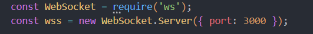
در این قسمت، اتصال کلاینت ها و آیدی دادن به آن‌ها را با این مدل نیمینگ هاردکد کردیم:
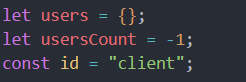
به این ترتیب که چنانچه مشخص است، با کانکت شدن هر کلاینت، آیدی‌ای به فرمت client[num] اختصاص داده می‌شود.

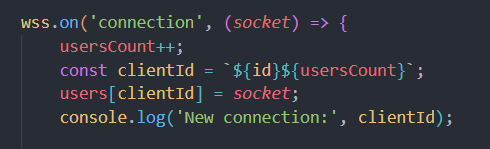


در این قسمت، با توجه به پیامی که در توابع main.qml از سمت سوکت کلاینت متناظر به سرور فرستاده‌ایم، سرور با گرفتن پیر آیدی، متناسب با درخواست پیام مربوطه، که یا ارسال offer sdp یا  answer sdp یا ice-candidate است را رسیدگی می‌کند و به سوکت پیر، که پیش‌تر آن‌ها را در یک ساختار map ذخیره کرده است، می‌فرستد.

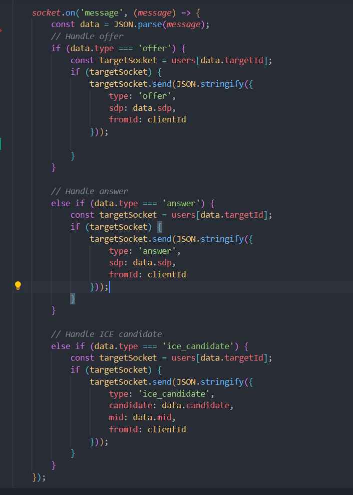

با بسته شدن سوکت کلاینت متناظر، در پنجره‌ای اعلام می‌شود:
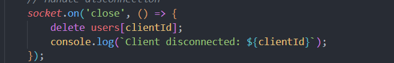

---

## main.cpp
در این قسمت کلاس‌های c++ را برای استفاده در فایل qml فراخوانی کرده‌ایم:
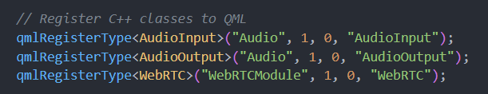
در این قسمت، فایل qml را از آدرسش بارگذاری می‌کنیم و سپس چک می‌کنیم درست بالا آمده یا خیر.. در این صورت با منفی یک خارج می‌شویم

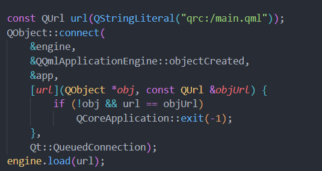
در این خط وارد لوپ ایونت‌های برنامه می‌شویم:
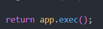


در این فایل، `Server.js` رو داریم که کارش پیاده‌سازی یک سرور WebSocket ساده برای برقراری ارتباط بین کلاینت‌هاست. در اینجا WebSocket جایگزین Socket.io شده و به جای اون مورد استفاده قرار گرفته. دلیل این جایگزینی این بود که WebSocket با ساختار `main.qml` که طراحی کردیم، راحت‌تر هماهنگ شد و نیازهای ما رو بهتر برآورده کرد.

---

### راه‌اندازی سرور WebSocket

در ابتدا، WebSocket رو از کتابخونه‌اش فراخوانی می‌کنیم و سرور `WebSocket` رو ایجاد می‌کنیم تا روی پورت 3000 منتظر اتصالات کلاینت‌ها باشه:

```javascript
const WebSocket = require('ws');
const wss = new WebSocket.Server({ port: 3000 });
```

این کد به سرور دستور می‌ده که هر کلاینتی که قصد برقراری اتصال داره، روی پورت 3000 بهش وصل بشه. 


---

### مدیریت اتصالات کلاینت‌ها و تخصیص آیدی‌ها

در این سرور برای مدیریت اتصالات از یک روش نیمینگ ساده و هاردکد شده استفاده کردیم. هر بار که یک کلاینت جدید متصل می‌شه، یک آیدی جدید به فرمت `client[num]` براش اختصاص داده می‌شه، که `num` همون شمارنده‌ی کلاینت‌ها هست.

```javascript
let users = {};
let usersCount = -1;
const id = "client";

wss.on('connection', (socket) => {
    usersCount++;
    const clientId = `${id}${usersCount}`;
    users[clientId] = socket;

    console.log('New connection:', clientId);
});
```

به این ترتیب، وقتی کلاینتی به سرور متصل بشه، یک آیدی یکتا دریافت می‌کنه و در نقشه (map) `users` ذخیره می‌شه که دسترسی سریع و راحت بهش ممکن باشه. این روش ساده و کارآمده و باعث می‌شه به راحتی کلاینت‌ها رو مدیریت کنیم.


---

### مدیریت پیام‌های WebRTC - هماهنگی با پیام‌های ارسال شده از main.qml

در اینجا، پیام‌هایی که از کلاینت‌ها ارسال می‌شه، پردازش و بر اساس نوع پیام به مقصد صحیح فرستاده می‌شه. این پیام‌ها از `main.qml` سمت کلاینت، به سرور فرستاده می‌شه و سرور براساس نوع پیام به درخواست رسیدگی می‌کنه. در WebRTC پیام‌ها عمدتاً به سه دسته‌ی اصلی تقسیم می‌شن: `offer`، `answer` و `ice_candidate`.

```javascript
socket.on('message', (message) => {
    const data = JSON.parse(message);
    console.log('SSSSSSSSSSSSSSSSSSSSSSSSSSSSSSSSSSSSSS:',message);

    // Handle offer
    if (data.type === 'offer') {
        const targetSocket = users[data.targetId];
        console.log('HHHHHHHHHHHHHHHHHHHHHHHHHHHHHHH:');
        if (targetSocket) {
            targetSocket.send(JSON.stringify({
                type: 'offer',
                sdp: data.sdp,
                fromId: clientId
            }));
            console.log('LLLLLLLLLLLLLLLLLLLLLLLLLLLLLLLLLLLLLL:');
        }
    }

    // Handle answer
    else if (data.type === 'answer') {
        const targetSocket = users[data.targetId];
        console.log('pppppppppppppppppppppppppppppp:',message);
        if (targetSocket) {
            targetSocket.send(JSON.stringify({
                type: 'answer',
                sdp: data.sdp,
                fromId: clientId
            }));
            console.log('ggggggggggggggggggggggggggggggggggg:');
        }
    }

    // Handle ICE candidate
    else if (data.type === 'ice_candidate') {
        const targetSocket = users[data.targetId];
        if (targetSocket) {
            targetSocket.send(JSON.stringify({
                type: 'ice_candidate',
                candidate: data.candidate,
                mid: data.mid,
                fromId: clientId
            }));
        }
    }
});
```

در این بخش، پیام‌ها از کلاینت میاد، به فرمت JSON تبدیل می‌شه و بر اساس نوع پیام پردازش می‌شه:


در WebRTC، این پیام‌ها برای برقرار کردن ارتباط مستقیم بین کلاینت‌ها ضروریه. با نگهداری هر اتصال به عنوان یک ورودی در `users`، ارسال پیام‌ها به مقصد بسیار راحت‌تر می‌شه. به علاوه، `console.log`‌های متعدد برای دیباگ کردن در طول کد قرار داده شده تا مطمئن بشیم پیام‌ها به درستی در هر مرحله ارسال و پردازش می‌شن.


---

### مدیریت قطع اتصال کلاینت‌ها


هر وقت که کلاینت ارتباطش رو با سرور قطع کنه، پیام دیباگی در `console` نشون داده می‌شه تا بدونیم که کلاینت با موفقیت قطع شده و آیدی مربوطه از `users` حذف شده.


---


## main.qml
در این قسمت، اتفاقی که با کلیک کردن بر روی دکمه رقم می‌خورد را تعیین می‌کنیم. دو نکته در ابتدای کدزدن برای ما چالش بود،
یک آنکه فراموش کرده بودیم اینجا نقطه ای است که باید addPeer شود و دوم آنکه اینجاست که با درخواست کال، باید متد generateOfferSDP را صدا کنیم.
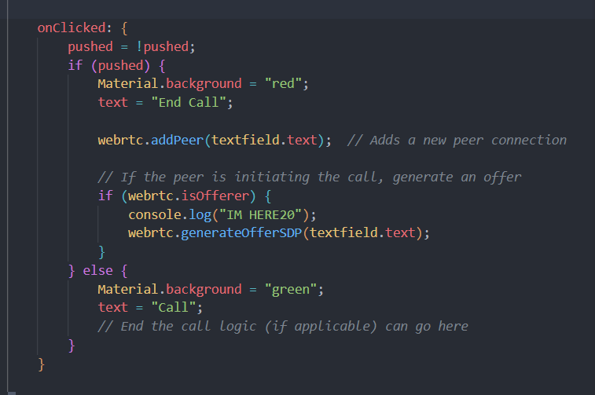

در این قسمت، آبجکت webrtc را داریم که با آن تعیین می‌کنیم مابه‌ازای امیت‌شدن هر سیگنال، چه اتفاقی رخ بدهد
اینکه چطور پکت دریافت شده را به خروجی صدا برسانیم، از محل‌های چالشی برای ما بود که نهایتا فهمیدیم با امیت‌شدن سیگنال incomingPacket، باید خروجی را به آبجکت output  برسانیم
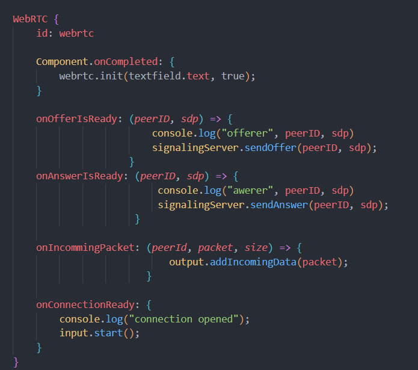


## webrtc.cpp

در این قسمت، تعدادی کانفیگ‌های اولیه را انجام می‌دهیم:
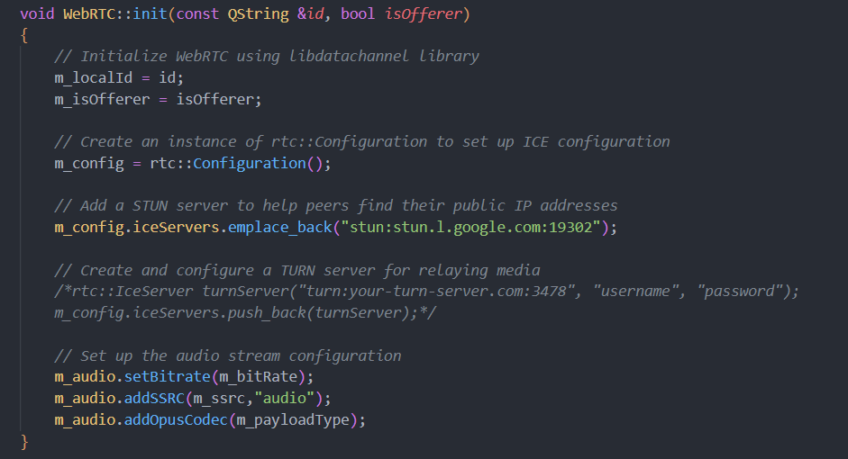

در این دو متد، به دنبال ساختن SDPهای offerer  و answerer هستیم، ابتدا با دریافت آیدی پیر مدنظر، در مپ peer connectionها به دنبال آیدی پیری که قرار است برای آن sdp ارسال شود میگردیم و سپس آن را به عنوان  local description  طرف مقابل تنظیم می‌کنیم. در پیاده سازی این بخش، تعدادی ایراد سینتکسی داشتیم که به چالش خوردیم.
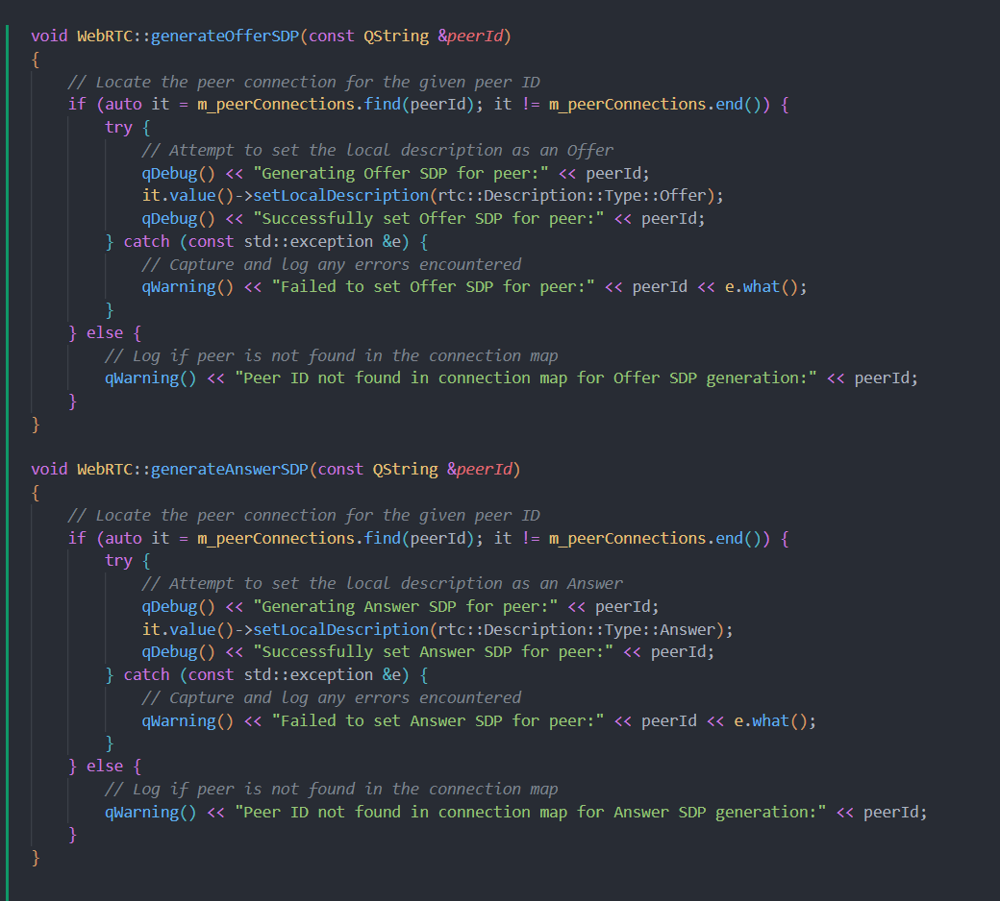

### addPeer
در این قسمت، مکررا به دنبال عوض‌شدن وضعیت gathering  هستیم. به محض اینکه این اتفاق افتاد؛ سیگنال مربوطه را امیت میکنیم تا اتصال پیرها و ست شدن اس دی پی های مربوطه که تا پیش از آن مکررا ساخته می شدند، صورت بگیرد.
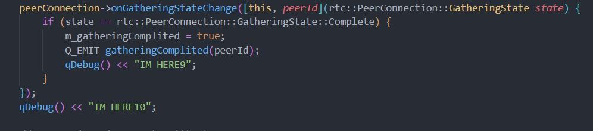

### Set remote candidate & Description
در این بخش‌ها، SDP دریافت شده یا ICE دریافت شده از سمت پیر خود را که از سیگنالینگ سرور به واسطه  main.qml به ما رسیده است را ست میکنیم.
برای ست کردن ریموت کندیدیت، در مپ پیرها به دنبال پیر متناظر میگردیم و در صورت یافت شدن آن را قرار میدهیم، اما برای ست کردن لوکال دسکریپشن، ابتدا اگر نبود آن را به پیرها اضافه میکنیم و سپس با ایجاد کانکشن، به آن سمت پیش میرویم

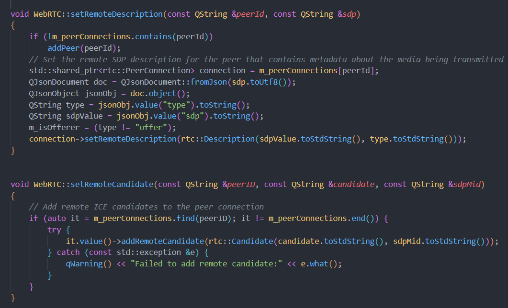
---

## Coturn
### ۱. دریافت VPS از Microsoft Azure

وی‌پی‌اس (VPS) رو دوستمون از Microsoft Azure گرفته که به لطف دسترسی دانشجویی GitHub رایگان شد. داشتن یک سرور ابری با IP ثابت به ما کمک می‌کنه که سرور TURN و STUN رو طوری تنظیم کنیم که به راحتی از هر جایی تو اینترنت در دسترس باشه.

### ۲. نصب `coturn` و پیکربندی تنظیمات

برای راه‌اندازی سرور TURN و STUN، از نرم‌افزار `coturn` استفاده کردیم که هم محبوب و هم قابل اعتماد هست. بعد از نصب روی VPS، تنظیمات زیر رو براش تعریف کردیم تا به خوبی هر دو سرویس رو پوشش بده. اینجا نگاهی به فایل تنظیمات و توضیح هر بخشش می‌اندازیم:

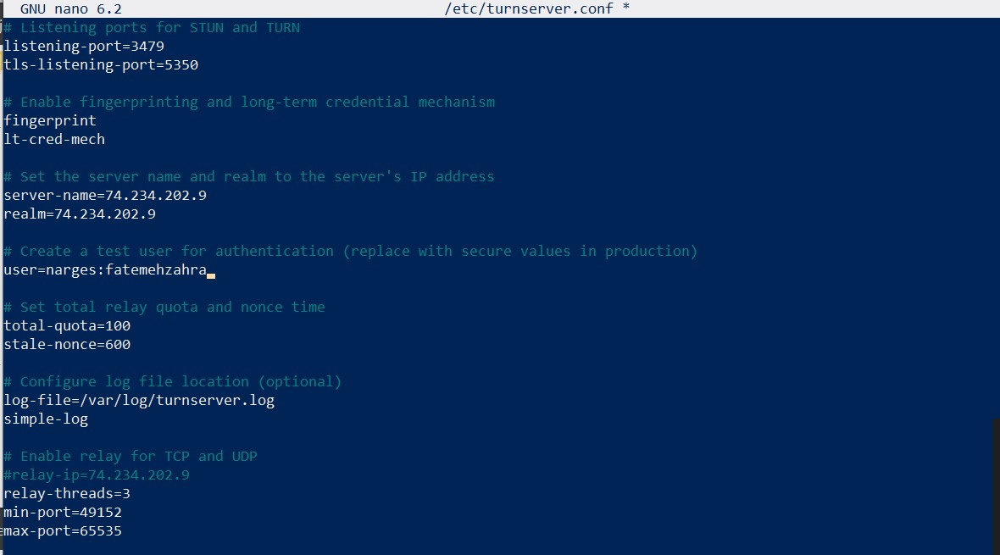

- **پورت‌های شنود**: 
  - `listening-port=3479` و `tls-listening-port=5350` به پورت‌های استاندارد تنظیم شده‌اند.

- **Fingerprint و مکانیزم احراز هویت**:
  - `fingerprint` به هر بسته‌ی داده یک اثر انگشت اضافه می‌کنه تا کاربران بتونن صحت داده‌ها رو راحت‌تر تأیید کنن.
  - `lt-cred-mech` مکانیزم احراز هویت بلندمدت رو فعال می‌کنه، که نیاز به ورود نام کاربری و رمز داره.

- **نام سرور و Realm**:
  - `server-name` و `realm` به IP عمومی سرور تنظیم شده‌اند، تا سرور بتونه خودش رو تشخیص بده که مخصوصاً تو مراحل تست مفیده.

- **احراز هویت کاربر**:
  - با `user=guest:somepassword` یک کاربر تست برای آزمایش ارتباطات تعریف کردیم. در محیط واقعی، بهتره از رمزهای قوی و منحصر به فرد استفاده کنید.

- **سهمیه و تنظیمات امنیتی**:
  - `total-quota=100` تعداد حداکثر اتصالات همزمان رو محدود می‌کنه تا از بار زیاد جلوگیری بشه.
  - `stale-nonce=600` توکن‌های احراز هویت رو بعد از ۱۰ دقیقه باطل می‌کنه تا امنیت بیشتری برابر با حملات replay فراهم بشه.

- **لاگ‌گیری**:
  - `log-file` فعالیت‌ها رو در `/var/log/turnserver.log` ذخیره می‌کنه و `simple-log` لاگ‌ها رو خلاصه‌تر می‌کنه.

- **انتقال برای TCP و UDP**:
  - `relay-ip` رو به IP عمومی سرور تنظیم کردیم و `relay-threads=3` به سرور اجازه می‌ده که ارتباطات رو روی چندین رشته پردازش کنه.
  - محدوده‌ی پورت‌های `min-port` و `max-port` پورت‌های اتصال‌های انتقال‌یافته رو مشخص می‌کنه و احتمال تداخل با سایر سرویس‌ها رو کاهش می‌ده.

### ۳. تست سرور STUN و TURN

برای اطمینان از صحت عملکرد سرور، از ابزار [Trickle ICE](https://webrtc.github.io/samples/src/content/peerconnection/trickle-ice/) استفاده کردیم. این ابزار اتصالات رو تست می‌کنه و کانديداهای مختلف ICE رو که سرور برای STUN و TURN تولید می‌کنه، نشون می‌ده. خوشبختانه همه چیز بدون مشکل کار کرد و سرور به خوبی پاسخ می‌داد.
عکس ها رو در لینک زیر ببینید.
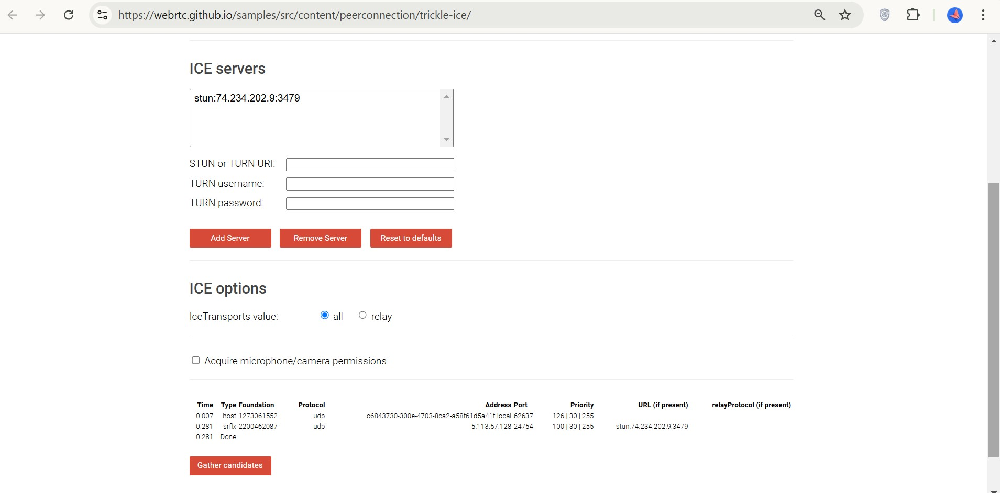
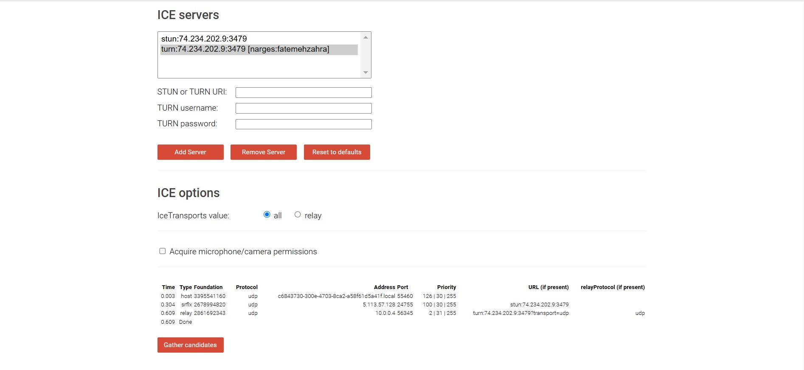

### ۴. اضافه کردن سرور سیگنالینگ

برای ایجاد ارتباط اولیه بین کلاینت‌ها، به سرور سیگنالینگ نیاز داشتیم. کد سرور سیگنالینگ که به زبان JavaScript نوشته شده بود رو روی VPS اضافه کردیم و با استفاده از `pm2` اونو مدیریت کردیم. `pm2` خیلی کمک می‌کنه چون سرور رو در پس‌زمینه نگه می‌داره و در صورت کرش، دوباره راه‌اندازی می‌کنه. حالا سرور سیگنالینگ همیشه فعال و آماده‌ی کمک برای برقراری اتصالات WebRTC هست.

#### نتیجه نهایی

با وجود سرورهای TURN/STUN و سیگنالینگ روی VPS، همه چیز آماده‌ست. حالا اپلیکیشن WebRTC ما می‌تونه بدون نیاز به تنظیمات اضافی یا وابستگی‌های محلی، به طور مستقیم ارتباط برقرار کنه. این تنظیمات کاملاً روی سرور میزبانی می‌شن، بنابراین کاربران حتی پشت NAT و فایروال هم می‌تونن به کمک سرور TURN به راحتی ارتباط peer-to-peer برقرار کنند.

## Audio Output

کلاس `AudioOutput` وظیفه پخش صدا در برنامه را بر عهده دارد. این کلاس از طریق فریمورک Qt و با استفاده از کتابخانه Opus برای پردازش صوت طراحی شده است.

در ابتدا، در سازنده این کلاس (`AudioOutput::AudioOutput`)، تنظیمات اولیه برای فرمت صدا انجام می‌شود. ما فرمت را به گونه‌ای تنظیم می‌کنیم که نرخ نمونه‌برداری 48 کیلوهرتز باشد و از صدای مونو (یک کانال) استفاده کنیم. سپس یک دیکودر Opus ایجاد می‌کنیم که برای تبدیل داده‌های فشرده شده صوتی به فرمت قابل پخش به کار می‌رود.

پس از این مراحل، یک شی از `QAudioSink` ساخته می‌شود. این شی به ما اجازه می‌دهد تا صدای خروجی را از طریق دستگاه صوتی پیش‌فرض سیستم پخش کنیم. همچنین با اتصال سیگنال `newPacket` به متد `play`، زمانی که داده جدیدی به صف اضافه می‌شود، این متد فراخوانی می‌شود.

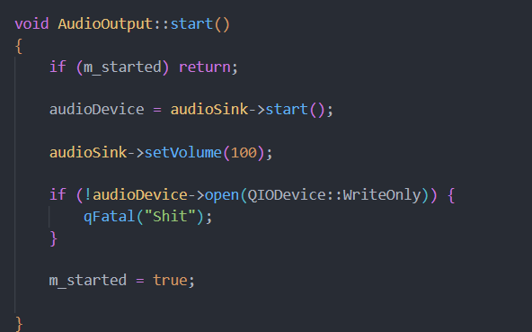
متد `start` مسئول آغاز کار با دستگاه صوتی است. در اینجا، اگر متد قبلاً فراخوانی نشده باشد، دستگاه صوتی شروع به کار می‌کند و حجم صدای خروجی به 100 درصد تنظیم می‌شود. اگر در باز کردن دستگاه مشکلی وجود داشته باشد، یک پیام خطا چاپ می‌شود.

در متد `addData`، داده‌های صوتی جدید به صف اضافه می‌شوند. این کار با قفل کردن یک mutex انجام می‌شود تا از دسترسی همزمان جلوگیری شود. سپس سیگنال `newPacket` ارسال می‌شود تا نشان دهد که داده جدیدی برای پخش در دسترس است.

متد `play` وظیفه دارد تا داده‌های صوتی موجود در صف را پخش کند. ابتدا mutex قفل می‌شود تا اطمینان حاصل شود که دسترسی به صف به درستی مدیریت می‌شود. اگر داده‌ای در صف وجود داشته باشد، اولین بسته از صف حذف و پردازش می‌شود. سپس داده‌های ورودی به وسیله دیکودر Opus، دیکد و به فرمت قابل پخش تبدیل می‌شوند.

در نهایت، داده‌های خروجی به دستگاه صوتی نوشته می‌شوند. 


## Third Step

### WebRTC

WebRTC کاملاً رایگان و متن‌بازه، و از انتقال صدا، تصویر و داده به‌صورت نظیر به نظیر (P2P) پشتیبانی می‌کنه. این پروتکل می‌تونه ارتباطات بلادرنگ (Real-Time Communication) رو از طریق مرورگرها و اپلیکیشن‌ها فراهم کنه. 

سیگنالینگ سرور در پروتکل ارتباط WEBRTC انگار به عنوان واسطه‌ای برای تبادل اطلاعات اولیه مانند SDP و ICE candidates عمل می‌کنه، تا وقتی که کانکشن از طریق webrtc ممکن شه. کلاینت ها SDp خود و ICE Candidate ها را پیش از ایجادشدن این ارتباط، از این طریق جابه‌جا می‌کنن.

پروتکل ICE (Interactive Connectivity Establishment) برای پیدا کردن بهترین مسیر جهت اتصال بین دستگاه‌ها استفاده می‌شه. وقتی دستگاه‌ها پشت روترهای NAT یا فایروال قرار دارن و ارتباط برقرار نمی‌شه، ICE با کمک سرورهای STUN و TURN این موانع رو رد می‌کنه.
ICE همه مسیرهای ممکن رو برای انتقال مدیا بین دستگاه‌ها جمع می‌کنه. اول، با استفاده از سرورهای STUN تلاش می‌کنه تا آی‌پی دستگاه‌ها رو پیدا کنه و ارتباط مستقیم برقرار کنه. اگه موفق نشه، از سرور TURN به‌عنوان واسطه استفاده می‌کنه تا ارتباط بین دستگاه‌ها برقرار بشه.

### Coturn

Coturn به عنوان یک سرور STUN و TURN نقش کلیدی در برقراری ارتباطات WebRTC داره. با استفاده از STUN، کاربران می‌تونند به راحتی آدرس‌های IP و پورت‌های خود را شناسایی کنن، که این امر به برقراری ارتباطات سریع و مستقیم کمک می‌کنه. 
با این حال، Coturn به تنهایی قادر به حل تمامی چالش‌های NAT نیست. در مواقعی که ارتباط مستقیم ممکن نیست، TURN به عنوان یک واسطه عمل می‌کنه و داده‌ها را از طریق سرور خود منتقل می‌کنه. این کار به ایجاد ارتباط در شرایط پیچیده‌تر کمک می‌کند، اما ممکنه باعث بروز تأخیر و افزایش مصرف پهنای باند بشه. 
